# 📟 Portfolio Observability Microservice


> **A high-performance, cyberpunk-themed telemetry dashboard built with Next.js 16.**
> This microservice aggregates, processes, and visualizes real-time infrastructure metrics from Prometheus and GitHub, serving as the central "Brain" of the DevOps Portfolio ecosystem.

---

## 🔮 Architecture Overview

This service acts as a secure proxy and visualization layer between the public internet and the private infrastructure control plane.

```mermaid
graph TD
    subgraph Client ["🖥️ Client Representation"]
        Browser[("🌐 User Browser")]
    end

    subgraph Service ["🚀 Next.js Microservice (SSR/API)"]
        Dashboard["📊 Dashboard UI\n(Recharts / Client Components)"]
        APIRoute["⚡ API Routes\n(Server-Side Proxy)"]
    end

    subgraph Infrastructure ["🔒 Private Infrastructure Cluster"]
        Prometheus[("🔥 Prometheus\nTime-Series DB")]
        cAdvisor["📦 cAdvisor\n(Docker Metrics)"]
        NodeExp["🖥️ Node Exporter\n(System Metrics)"]
        Traefik["🚥 Traefik\n(Edge Router Metrics)"]
    end

    subgraph External ["☁️ External Services"]
        GitHub[("🐙 GitHub API")]
    end

    %% Data Flow
    Browser -- "HTTP/S Request" --> Dashboard
    Dashboard -- "Fetch /api/metrics" --> APIRoute
    APIRoute -- "Authenticated Query" --> Prometheus
    APIRoute -- "REST API" --> GitHub
    
    %% Prometheus Collection
    Prometheus -.-> cAdvisor
    Prometheus -.-> NodeExp
    Prometheus -.-> Traefik

    %% Styling
    style Browser fill:#f9f,stroke:#333,stroke-width:2px
    style Service fill:#111,stroke:#00FF41,stroke-width:2px,color:#fff
    style Infrastructure fill:#0f172a,stroke:#3b82f6,stroke-width:2px,color:#fff
    style Prometheus fill:#e11d48,stroke:#fff,stroke-width:2px
    style Dashboard fill:#22c55e,stroke:#fff,color:#000
```



## ✨ Key Features

* **Cyberpunk Aesthetic**: Modern UI with "glitch" text effects, neon glows, and glassmorphism using **Tailwind CSS v4**.
* **Real-Time Visualization**: Interactive charts powered by **Recharts**, displaying CPU, RAM, Disk, and Network traffic.
* **Secure Proxy Architecture**: Direct database connections (Prometheus) are handled server-side. Reviewers never touch the backend directly.
* **Smart Containment Masking**: Sensitive container names are obfuscated with deterministic hexadecimal hashes (`SECURE-MODULE-0x...`) while keeping safe public services (Odoo, WordPress) recognizable.
* **Interactive Filtering**: Drill-down capabilities for specific container metrics and time-range adjustments (1h, 6h, 24h).

## 🛠️ Technology Stack

| Category | Technology | Description |
| :--- | :--- | :--- |
| **Framework** | **Next.js 16 (App Router)** | Server Components & Server Actions for optimized performance. |
| **Language** | **TypeScript** | Strict typing for robust API handling and component props. |
| **Styling** | **Tailwind CSS v4** | Next-generation utility-first CSS with native variable support. |
| **Visualization** | **Recharts** | Composable, responsive charting library based on SVG. |
| **Data Source** | **Prometheus** | Industry-standard monitoring system and time series database. |
| **Containerization** | **Docker** | Fully containerized deployment workflow. |

## 🚀 Getting Started

### Prerequisites

* Node.js 20+
* Prometheus instance running locally or remotely

### Installation

1. **Clone the repository**

    ```bash
    git clone https://github.com/yourusername/portfolio-observability.git
    cd portfolio-observability
    ```

2. **Install dependencies**

    ```bash
    npm install
    ```

3. **Configure Environment**
    Create a `.env.local` file with your credentials:

    ```env
    PROMETHEUS_URL=http://your-prometheus-ip:9090
    # Optional: Basic Auth if properly protected
    PROMETHEUS_USERNAME=admin
    PROMETHEUS_PASSWORD=secure_password
    GITHUB_TOKEN=your_github_pat
    ```

4. **Run Development Server**

    ```bash
    npm run dev
    ```

## 🛡️ Security Measures

* **Server-Side Fetching**: All external API calls (GitHub, Prometheus) happen on the Next.js server. No API keys are exposed to the client bundle.
* **CORS Configuration**: Strict Headers configuration to only allow requests from the main portfolio domain.
* **Data Sanitization**: Internal infrastructure details are masked before being sent to the frontend.

---

<div align="center">
  <p>Part of the <b>High-Performance DevOps Portfolio</b> series.</p>
  <sub>Built with ❤️ and ☕ by Peter</sub>
</div>
